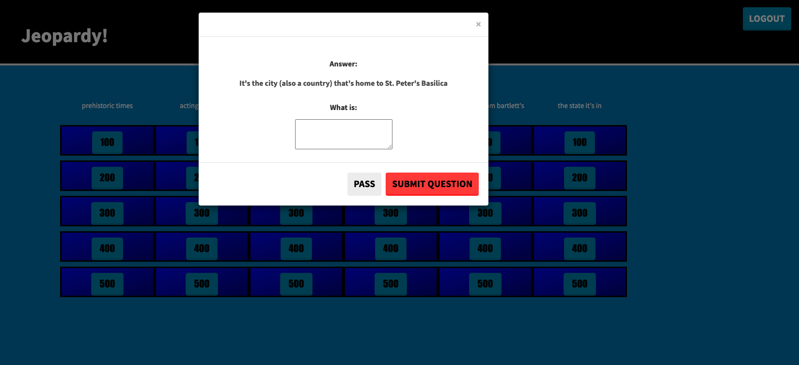

# Jeopardy Trivia
## Group 5 - Project 2

***

## User Story

* AS A Jeopardy and/or trivia enthusiast,
* I WANT to play a game by creating a login, clicking the game option,
* AND THEN I can keep track of my scores.

## Description

An Alex Trebek Tribute application where you can reminisce and play a <em>version</em> of Jeopardy

## Project/Application Requirements

* Must use a Node and Express server.
* Must use Handlebars.js as the template engine.
* Must be backed by a MySQL database with a Sequelize ORM.
* Must utilize both GET and POST routes for retrieving and adding new data.
* Must be deployed using Heroku (with data).
* Must utilize at least one new library, package, or technology that we haven’t discussed.
* Must have a polished front end/UI.
* Must have a folder structure that meets the MVC paradigm.
* Must meet good quality coding standards (indentation, scoping, naming).
* Must protect API keys in Node with environment variables.

## API

The Alex Trebek Tribute Trivia Challenge utilizes one API that provides over 156,000 trivia questions, clues, categories, answers and more. 

* [jService](http://jservice.io//) - Thanks for the great API, Steve Ottenad! (@scottenad - https://github.com/sottenad)

## Game Screenshot

## Template Engine

The application framework for this site is by [Handlebars](https://handlebarsjs.com/)

### Application Deployment Link - Heroku

[Jeopardy Trivia Game](https://shielded-fjord-19309.herokuapp.com/)

### Repository

[GitHub](https://github.com/Geoff7709/jeopardy_trivia_game)

### Contributors

Thanks to the following people who have contributed to this project:

* [@GeoffreyZimmerman](https://github.com/Geoff7709) 
* [@DavidSotomayor](https://github.com/DavidESotomayor)
* [@DestaMulualem](https://github.com/destish21)
* [@TracyGolden](https://github.com/tracy80s2003) 

### 